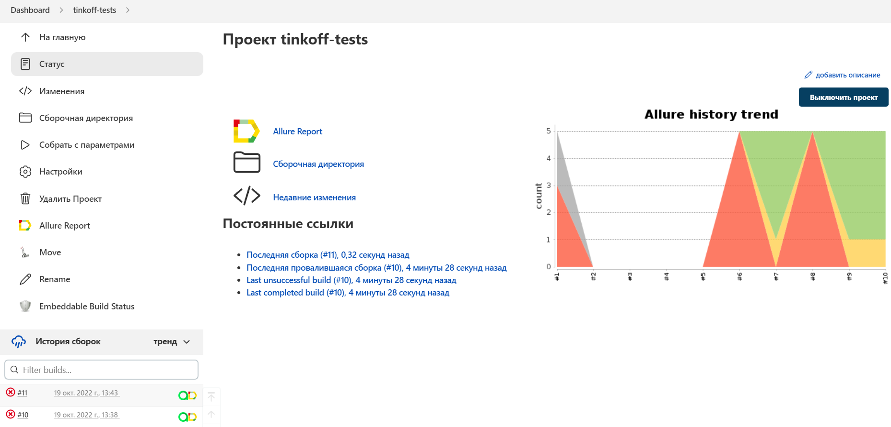
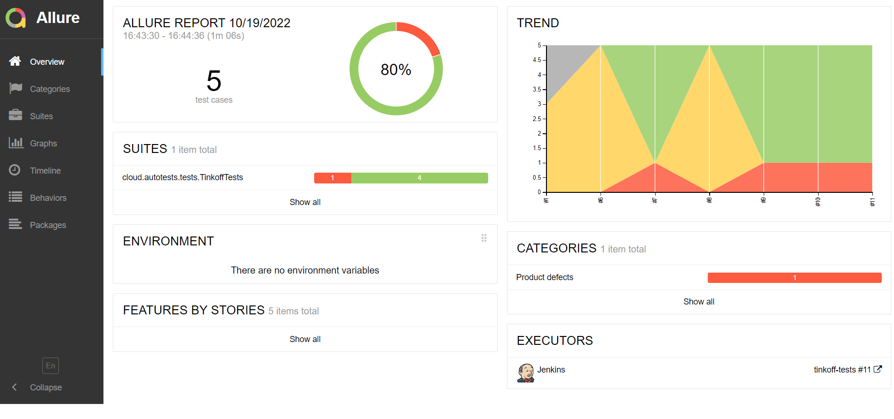
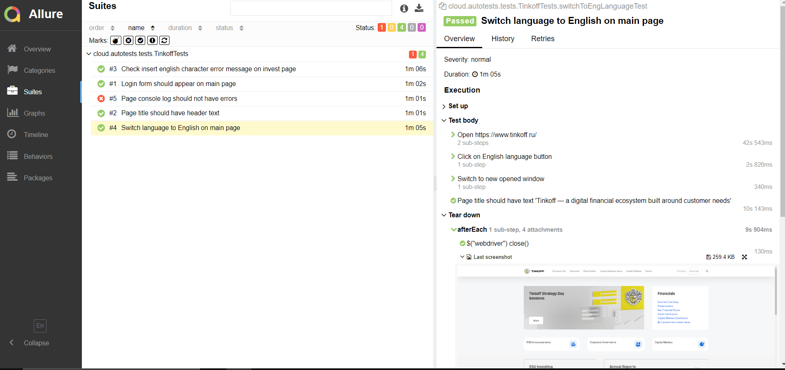
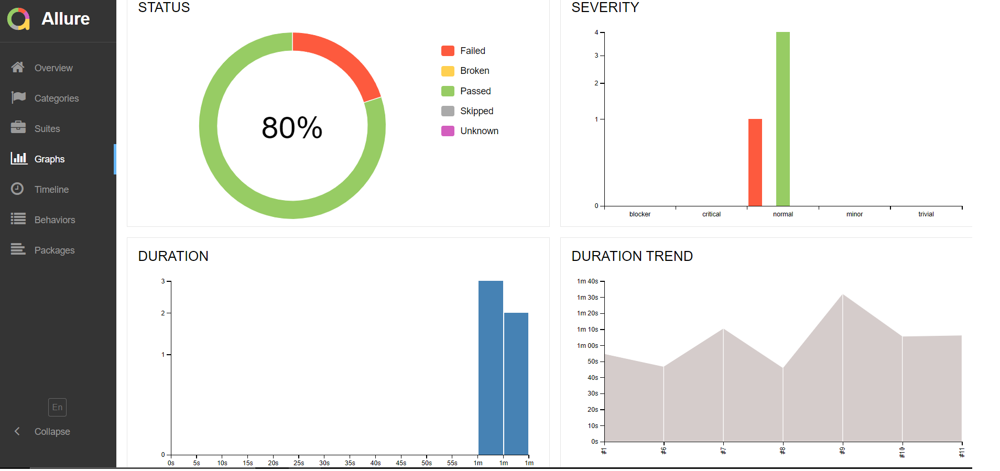
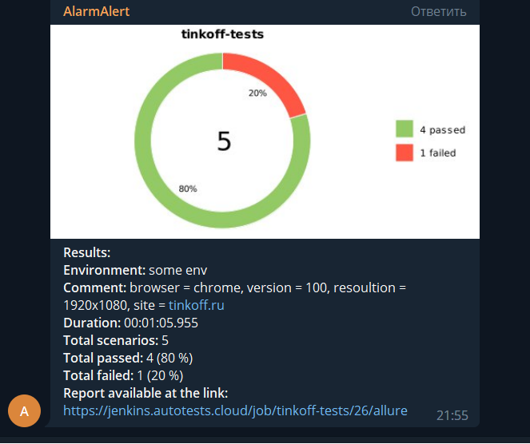
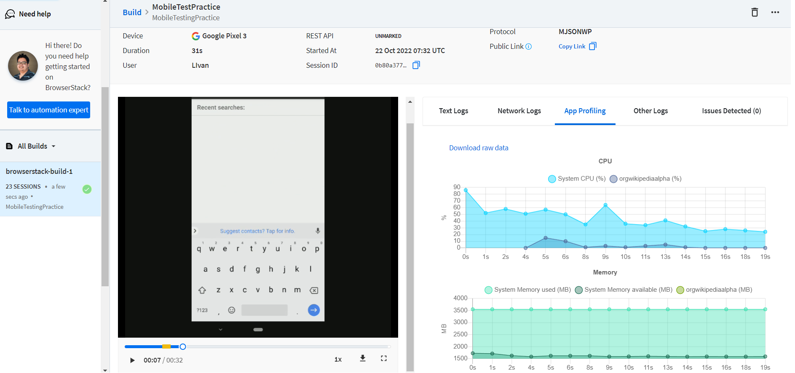
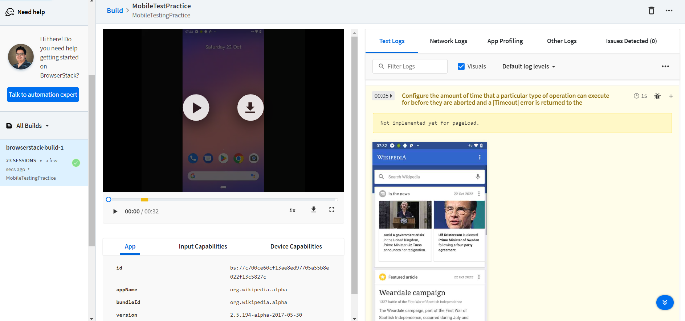

## :scroll: О себе
### Тестировщик с навыками автоматизации
## :technologist: Технологии и инструменты

## Примеры применения технологий

## </a> Jenkins <a target="_blank" href="https://jenkins.autotests.cloud/job/tinkoff-tests/"> job </a>

### :maple_leaf: Параметры сборки в Jenkins:

- browser (браузер, по умолчанию chrome)
- version (версия браузера, по умолчанию 100.0)
- size (размер окна браузера, по умолчанию 1920x1080)
- remoteUrl (логин, пароль и адрес удаленного сервера selenoid)

## </a> Отчет в <a target="_blank" href="https://jenkins.autotests.cloud/job/tinkoff-tests/11/allure/">Allure report</a>

### :lady_beetle: Основное окно

### :cherries: Тесты

### :cut_of_meat: Графики

## </a> Уведомление в Telegram при помощи бота

## </a> Видео прохождения теста

 

## </a> Мобильное тестирование с BrowserStack

