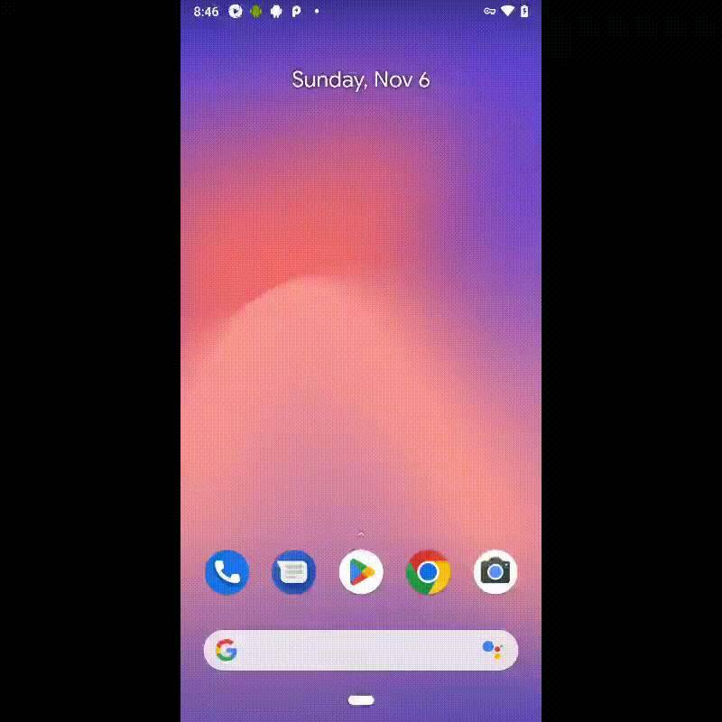

## :scroll: About myself

### --== QA engineer with qa automation skills ==--

### --== My Diploma Projects at QA GURU Test Automation ==--

| Project name             | GitHub links                                      |
|--------------------------|---------------------------------------------------|
| Mobile tests Project     | https://github.com/LIvanRSF/MobileTestingPractice |
| API and UI tests Project | https://github.com/LIvanRSF/globalL1              |

## :technologist: Stack and technologies

  
  

## Examples of work

## </a> Jenkins <a target="_blank" href="https://jenkins.autotests.cloud/job/tinkoff-tests/"> job </a>

## </a> Отчет в <a target="_blank" href="https://jenkins.autotests.cloud/job/tinkoff-tests/11/allure/">Allure report</a>

### :lady_beetle: Main window

### :cherries: Tests

### :cut_of_meat: Graphs

## </a> Telegram notification with alert bot

## </a> Video report of test running

 

## </a> Mobile testing with BrowserStack

